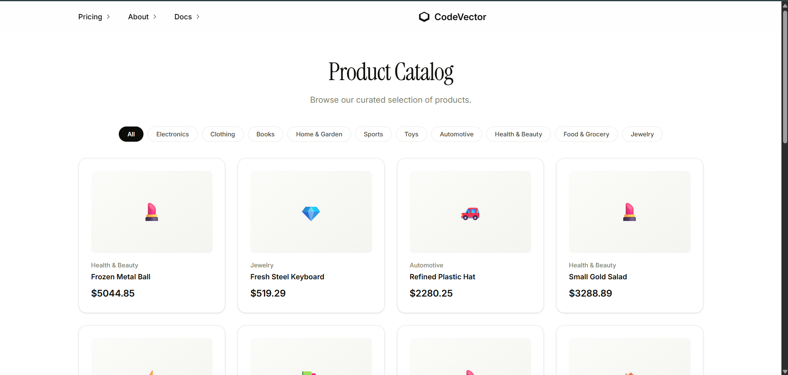

# CodeVector Assignment

A cursor-based pagination API with a Next.js frontend — browse 200,000 products, filter by category, paginate fast.

**Live URLs:**
- Frontend: [https://codevector-assignment-blond.vercel.app](https://codevector-assignment-blond.vercel.app)
- Backend: [https://codevector-assignment-mo62.onrender.com](https://codevector-assignment-mo62.onrender.com)



## Tech Stack

| Layer | Technology |
| ----- | ---------- |
| Runtime | Bun |
| Backend | Hono |
| Frontend | Next.js 16 + React 19 + Tailwind CSS |
| Database | PostgreSQL (Neon) |
| ORM | Prisma 7 |
| Validation | Zod |

## Backend Structure

```
backend/
├── prisma/
│   ├── schema.prisma     # Product model with composite indexes
│   ├── seed.ts           # Seeds 200K products (batch inserts)
│   └── migrations/
├── src/
│   ├── index.ts          # Hono app entry
│   ├── config.ts
│   ├── lib/
│   │   ├── prisma.ts     # Prisma client singleton
│   │   └── cursor.ts     # Base64 cursor helpers
│   ├── routes/
│   │   └── products.route.ts
│   └── schemas/
│       └── product.schema.ts
├── tests/
├── Dockerfile
└── package.json
```

## API

### `GET /products`

| Param | Type | Default | Description |
| ----- | ---- | ------- | ----------- |
| `limit` | number | 20 | Page size (1–100) |
| `cursor` | string | — | Opaque cursor from previous response |
| `category` | string | — | Filter by category |

Response:
```json
{
  "data": [{ "id": "uuid", "name": "...", "category": "...", "price": 99.99, "createdAt": "...", "updatedAt": "..." }],
  "nextCursor": "base64-string",
  "hasMore": true
}
```

### `GET /health`

Returns `{ "status": "ok" }`.

## Getting Started

```bash
cd backend
bun install
cp .env.example .env   # set DATABASE_URL
bunx prisma db push
bunx prisma generate
bun run prisma/seed.ts     # 200K products
bun run dev
```

Frontend:

```bash
cd client
npm install
npm run dev
```
